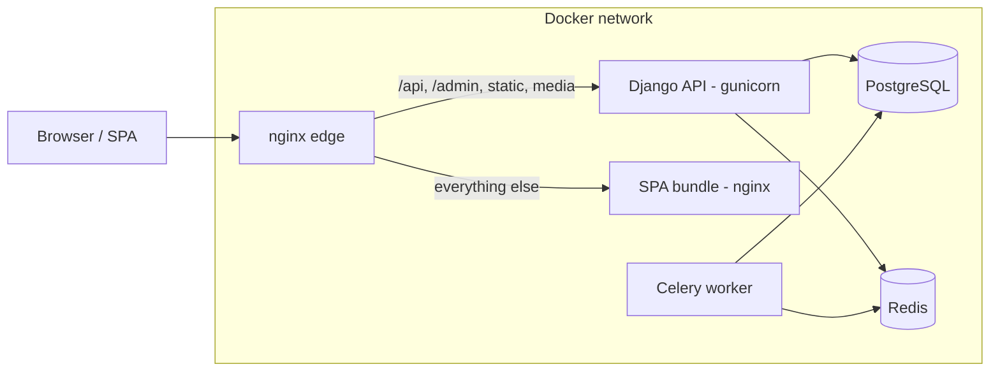
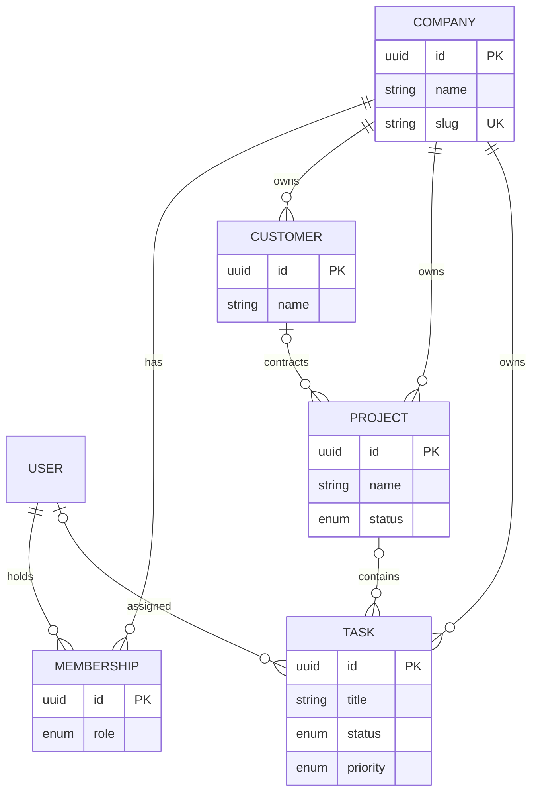
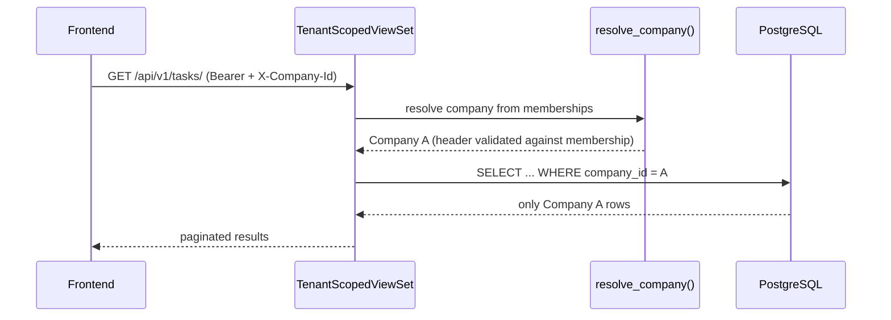

# Architecture Overview

How Nexora is put together and why.

## System Context



- **nginx** is the single public entrypoint. It routes by path prefix and
  forwards `X-Forwarded-Proto`, which production settings trust via
  `SECURE_PROXY_SSL_HEADER`.
- **frontend** container only serves hashed static assets with SPA fallback.
- **backend** owns all business data; nothing bypasses the API.
- **Celery** consumes the same image as the API; tasks live in `<app>/tasks.py`
  and are autodiscovered.

## Frontend/Backend Separation

The two applications share *nothing* except the HTTP contract:

- No server-side templating for product pages (Django templates exist only for
  admin/DRF browsable pages).
- The SPA holds routing state; deep links work because nginx falls back to
  `index.html`.
- The frontend talks exclusively to `/api/v1/` using JWT bearer tokens stored
  in `localStorage` (acceptable for v1; see "Known trade-offs").

## API Architecture

```
/api/v1/
├── auth/          register · token · token/refresh · token/verify · me
├── users/         member directory of the active company
├── companies/current/
├── customers/     ModelViewSet (tenant-scoped)
├── projects/      ModelViewSet (tenant-scoped)
└── tasks/         ModelViewSet (tenant-scoped)
```

Layering rules:

| Layer       | Responsibility                                              |
| ----------- | ----------------------------------------------------------- |
| View        | HTTP orchestration only                                     |
| Serializer  | Shape + field-level validation                              |
| Service     | Business logic & multi-step transactions (`services.py`)    |
| Selector    | Complex reads (introduce when queries grow)                 |
| Model       | Data integrity: constraints, indexes, invariants            |

Registration is the reference implementation of the service pattern:
`accounts.services.register_company()` creates user + company + admin
membership atomically; the view only translates serializer ⇄ service.

## Database Architecture

- PostgreSQL, one logical database per deployment.
- Every table uses UUID primary keys plus `created_at`/`updated_at`
  (`apps.core.db.models.TimestampedModel`).
- Foreign keys are intentional: tenant entities cascade with their company;
  cross-links (project→customer, task→project) use `SET_NULL`.

Core entities:



## Multi-Tenancy

Nexora uses **single-database, shared-schema tenancy**: every business row
carries a mandatory `company` foreign key. This keeps operations simple while
making leakage a query-level concern that is centralized in exactly two places:

1. **Resolution** — `apps.core.api.context.resolve_company()`
   picks the active company from the authenticated user's memberships
   (honoring an explicit `X-Company-Id` header). Result is cached on the
   request. A header naming a company the user does not belong to is ignored —
   it can never widen access.
2. **Enforcement** — `TenantScopedModelViewSet`
   filters every read by `company=request.company` and stamps every create.
   Writes of cross-tenant references (e.g. assigning another company's
   customer to a project) are rejected in serializer validation.

Because scoping lives in the base viewset, a new domain module inherits
isolation by default; reviewers only need to check *that* the base class is
used, not re-audit each endpoint.



## Authentication

- SimpleJWT with rotation enabled and blacklisting after rotation
  (`rest_framework_simplejwt.token_blacklist`).
- Access tokens default to 30 minutes, refresh to 7 days (env-tunable).
- Login returns `{access, refresh, user}` so clients render immediately
  without a second round-trip.
- Passwords use Django validators + PBKDF2 (MD5 hasher only in tests).
- The SPA attaches `Authorization` headers via an Axios interceptor and
  refreshes transparently once on 401 before redirecting to login.

### Email identity normalization

Email addresses are case-insensitive identifiers. Every write path stores
them fully lowercased — local part and domain:

- `UserManager.normalize_email()` lowercases the whole address
  (Django's default only lowercases the domain), so `create_user`,
  `create_superuser` and `createsuperuser` always persist lowercase.
- `User.save()` re-normalizes as a last resort, covering write paths that
  bypass the manager (admin `UserCreationForm`, scripts, data fixes).
- Authentication resolves users case-insensitively via
  `UserManager.get_by_natural_key()` (`email__iexact`), so logging in with
  any casing works.
- Duplicate registration is rejected case-insensitively: the service checks
  `email__iexact`, and a race past that check still hits the database unique
  constraint and surfaces the same domain error.

**Production data note:** rows created before this rule may hold mixed-case
emails. They continue to authenticate and deduplicate correctly because all
lookups are case-insensitive; no automatic migration touches existing rows.
If you later want a database-level guarantee (functional unique index on
`LOWER(email)`), first audit and normalize stored values manually, e.g.
resolve duplicates, then run
`UPDATE accounts_user SET email = LOWER(TRIM(email));` in a maintenance
window — the index migration must follow the cleanup or it will fail on
conflicting rows.

## Permissions

Roles are values on `Membership`, evaluated **per company**:

| Role     | Capabilities in the foundation                          |
| -------- | ------------------------------------------------------- |
| ADMIN    | Everything incl. company settings                       |
| MANAGER  | Day-to-day management incl. destructive record actions  |
| EMPLOYEE | Standard CRUD within their company                      |

Implementation contract:

- `IsCompanyMember` resolves and exposes `request.company` /
  `request.company_role`; every tenant view includes it first.
- `role_required(*roles)` builds permission classes from
  `companies.RoleChoices`. Views compose them in `get_permissions()`.
- No view or serializer branches on raw role strings — extend roles by
  editing choices + the central mapping, never call sites.

## Deployment Hardening

Decisions behind the infrastructure findings (L-8 … L-11):

- **Redis authentication** — the `redis` service runs with `--requirepass`
  sourced from `REDIS_PASSWORD`; Compose builds authenticated URLs for the
  Django cache (`/1`), Celery broker (`/0`) and the container healthcheck.
  An empty value falls back to a well-known development password so local
  stacks boot unchanged; real deployments must set a strong value. Redis is
  never port-published — it is reachable only on the internal Docker network.
- **No public backend port** — the backend publishes no host port; nginx on
  port 80 is the single public edge. For host-side debugging,
  `make up-dev` (the `docker-compose.dev.yml` overlay) binds
  `127.0.0.1:8000:8000`, loopback-only by construction.
- **API docs & admin exposure** — `/api/schema|docs|redoc/` and `/admin/**`
  are gated per request by `API_DOCS_ENABLED` / `ADMIN_ENABLED`
  (`apps.core.api.middleware.SurfaceExposureMiddleware`). A disabled surface
  answers 404 like a non-existent route. Development enables everything;
  production defaults docs to **off** (opt-in via env) and keeps admin
  available for legitimate administration while allowing full disablement.
- **SPA security headers** — the frontend nginx image injects
  `X-Content-Type-Options`, `X-Frame-Options: DENY`,
  `Referrer-Policy`, `Permissions-Policy` and a CSP compatible with the Vite
  build (self-hosted module scripts/styles, same-origin connections;
  `style-src 'unsafe-inline'` only because runtime-injected `<style>` tags
  are part of the Tailwind toolchain). Headers live in an included snippet
  because nginx does not inherit `add_header` into locations that declare
  their own. The public edge adds the same baseline to proxied API/admin
  responses; uploaded media keep their dedicated sandboxing headers.
- **HSTS** — emitted by Django's `SecurityMiddleware` only when the request
  actually arrived over HTTPS (`X-Forwarded-Proto`, trusted in production),
  so plain-HTTP development never advertises it. Domain-wide HSTS belongs to
  the TLS-terminating layer once deployed.

## Known Trade-offs

- localStorage tokens are XSS-exposed; moving refresh tokens to HttpOnly
  cookies is a deliberate future hardening step.
- Cross-tenant reference validation is application-level (serializer +
  tests); database-enforced composite FKs would add schema complexity and are
  deferred until a second write path exists.
- One user may hold several memberships (the context resolver supports it),
  but no UI switcher ships until multi-company accounts are a real scenario.
